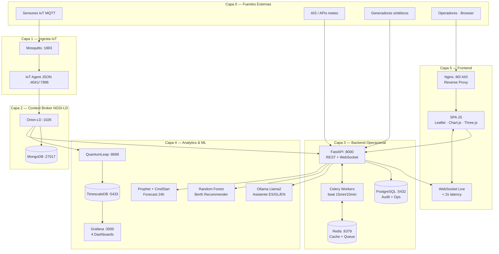
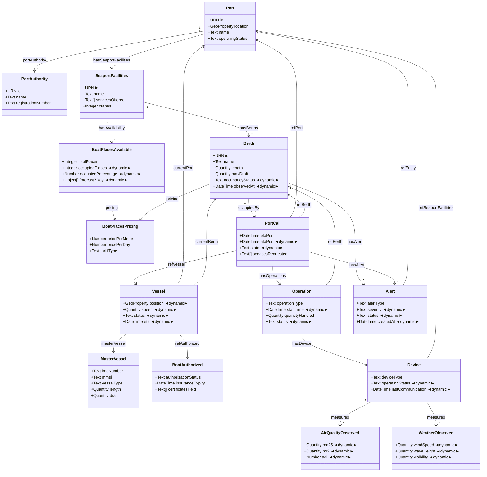

# SmartPort Galicia Operations Center — Application Document

**Versión:** 1.0  
**Fecha:** 2026-05-13  
**Autores:** Sergio Varela, Enrique Pérez González  
**Curso:** XDEI — Universidade da Coruña

---

## 1. Objetivo de la Aplicación

**SmartPort Galicia Operations Center** es una plataforma inteligente de gestión operativa en tiempo real para la red de puertos gallegos. Integra un mínimo de 11 puertos (escalable a 128+) en un sistema unificado multipuerto que proporciona:

- **Conciencia situacional en tiempo real** del estado operativo de toda la red portuaria
- **Gestión eficiente de atraques** mediante asignación asistida por ML y visualización 2D/3D
- **Predicción de ocupación** con modelos Prophet (CmdStan) entrenados con datos históricos reales
- **Monitorización ambiental y de seguridad** con alertas automáticas basadas en umbrales
- **Asistente conversacional** en castellano/gallego/inglés (LLM Ollama + Llama2)
- **Analytics histórico** vía pipeline Orion-LD → QuantumLeap → TimescaleDB → Grafana

El sistema responde a la necesidad de eliminar los silos de datos entre autoridades portuarias, pasando de una gestión reactiva y manual a una operación proactiva, predictiva e inteligente.

---

## 2. Estado del Arte del Dominio

### Puertos Inteligentes (Smart Ports)

El concepto de *smart port* integra IoT industrial, Big Data y IA para digitalizar las operaciones portuarias. Iniciativas como el Port of Rotterdam (PortXchange), Hamburgo (smartPORT) y Valencia (VPA Digital) demuestran que la digitalización reduce tiempos de escala un 15-30% y mejora la utilización de atraques hasta un 25%.

En Galicia, la Autoridad Portuaria de Vigo y Puertos de Galicia han iniciado proyectos piloto de digitalización, pero sin integración entre puertos ni estándares comunes de datos.

### FIWARE y NGSI-LD en el Dominio Marítimo

**FIWARE** es el estándar de facto para smart cities y smart ports en Europa, adoptado por la Comisión Europea y el Ministerio de Transportes. Sus componentes clave en este dominio:

- **Orion-LD**: Context Broker NGSI-LD para gestión del estado en tiempo real (entidades vivas)
- **QuantumLeap**: Persistencia de series temporales de atributos dinámicos
- **IoT Agent JSON**: Traducción de mensajes MQTT/HTTP a entidades NGSI-LD
- **Smart Data Models** (`dataModel.MarineTransport`, `dataModel.Ports`): modelos de datos oficiales reutilizados en SmartPort Galicia (Port, Berth, Vessel, PortCall, BoatAuthorized…)

La plataforma implementa NGSI-LD v1.6 (ETSI GS CIM 009) con 15+ tipos de entidad y 211 entidades iniciales cargadas en Orion-LD.

---

## 3. Funcionalidades Principales

| # | Módulo | Descripción |
|---|--------|-------------|
| 1 | **Mapa de Red Portuaria** | Mapa Leaflet con los 11+ puertos, KPIs en tiempo real, popups de estado |
| 2 | **Gestión de Atraques** | Vista tabla/grid con estado (libre/ocupado/reservado/mantenimiento), filtros, paginación |
| 3 | **Ciclo de Vida de Escala** | Creación y seguimiento de port calls: expected → active → operations → completed |
| 4 | **Registro de Operaciones** | Log de carga, descarga, aprovisionamiento, reparaciones asociadas a cada escala |
| 5 | **Autorización y Cumplimiento** | Estado de autorizaciones de buques (SOLAS, ISPS, seguro), alertas de caducidad |
| 6 | **Monitorización Ambiental** | Sensores IoT de calidad del aire y meteorología; alertas por umbral |
| 7 | **Analytics Histórico** | Dashboards Grafana sobre TimescaleDB: ocupación, evolución, KPIs operativos |
| 8 | **Forecasting ML** | Predicción de ocupación 7-24h con Prophet real (CmdStan) + Random Forest para asignación |
| 9 | **Asistente LLM** | Chat conversacional (Ollama/Llama2) con acceso a datos en vivo de Orion-LD |
| 10 | **WebSocket Live** | Actualizaciones push < 2s: cambios de atraque, llegadas de buques, nuevas alertas |
| 11 | **Visualización 3D** | Modelo Three.js del puerto con atraques coloreados por estado, hover con detalles, drag/zoom |
| 12 | **Motor de Alertas** | 9 tipos de alerta (viento, oleaje, visibilidad, desviación ETA, buque retrasado…), Celery beat |

---

## 4. Funcionalidades Detalladas

### 4.1 Backend (FastAPI + FIWARE)
- **REST API** con 40+ endpoints documentados (puertos, atraques, escalas, alertas, ML, LLM)
- **Orion-LD Client**: CRUD completo sobre las 15+ entidades NGSI-LD
- **Celery Workers**: tareas asíncronas — sweep de alertas (15 min), weather check (10 min), cleanup diario
- **Redis**: caché de respuestas y cola de tareas
- **Pipeline NGSI-LD → QuantumLeap → TimescaleDB**: subscripción activa para persistencia histórica
- **Seed de 211 entidades**: 8 puertos gallegos con coordenadas reales, 71 atraques, 10 buques, 11 sensores

### 4.2 Machine Learning
- **Prophet + CmdStan** (`prophet==1.1.5`, `cmdstanpy==1.2.4`): modelo de serie temporal entrenado con ventana de 30 días, horizonte de 24h. Endpoint: `GET /api/v1/forecasts/occupancy`
- **Random Forest** (scikit-learn): recomendador de atraque basado en especificaciones del buque (eslora, calado, tipo, servicios). Endpoint: `GET /api/v1/recommendations/berth`
- **Ecosistema sintético**: 4.500 buques, 90 días de histórico generado en 8 módulos para entrenamiento ML offline

### 4.3 Frontend (SPA vanilla JS)
- Arquitectura SPA con routing client-side, 16 páginas, lazy loading de módulos
- **Internacionalización (i18n)**: ES / GL / EN con selector en navbar, persistencia en localStorage
- **Exportar datos**: CSV desde vistas de atraques y escalas; impresión PDF desde centro de alertas
- **WebSocket Integrator**: reconexión exponencial, heartbeat 25s, bus de eventos interno
- **Chart.js**: tendencias de ocupación, distribución de alertas, KPIs históricos
- **Three.js 3D**: 12 atraques renderizados con colores por estado, raycasting hover, orbit controls

### 4.4 Observabilidad
- **Grafana** (puerto 3000): 4 dashboards auto-provisionados al arrancar el backend
- **Prometheus** (puerto 9090): métricas de FastAPI
- **Audit log** en PostgreSQL: registro de operaciones sensibles
- **Health endpoint**: `GET /health` con estado de todos los servicios

---

## 5. Diagrama de Arquitectura

> Referencia completa: [`docs/architecture.md`](architecture.md) (v1.5, 1.820 líneas)

---

## 6. Diagrama del Modelo de Datos

> Referencia completa: [`docs/data_model.md`](data_model.md) (v1.2, NGSI-LD v1.6, 211 entidades producción)

---

*Este documento forma parte del entregable académico del proyecto SmartPort Galicia Operations Center (XDEI/UDC, 2026).*
